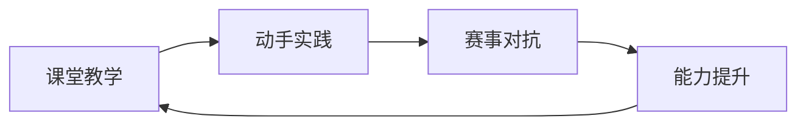

# 赛事生态全景

加速进化围绕人形机器人教育，构建了「自有赛事 + 合作赛事 + 区域赛事」三位一体的竞赛生态，覆盖国际、国内与区域多层次，实现从课堂学习到实战对抗的完整闭环。

## 赛事体系总览

| 赛事类型 | 赛事名称 | 定位 | 参赛群体 |
|----------|----------|------|----------|
| 自有赛事 | RoBoLeague | 国内首届机器人足球 3v3 AI 赛 | 高校、科研机构 |
| 合作赛事 | RoboCup | 国际顶级机器人赛事，官方合作伙伴 | 全球高校与研究团队 |
| 区域赛事 | 海淀区中学生人形机器人足球联赛 | 国内首批面向基础教育的赛事 | 中学师生 |

## 自有赛事：RoBoLeague

- **首届时间**：2025 年 6 月
- **赛事形式**：机器人足球 3v3 AI 对抗
- **统一平台**：Booster T1 作为竞赛开发平台
- **定位**：国内首个面向人形机器人足球的 AI 赛事，聚焦算法与策略对抗

## 合作赛事：RoboCup

- **合作身份**：RoboCup 官方合作伙伴（2024 年 12 月起）
- **参赛赛项**：AdultSize（T1）、KidSize（K1）
- **覆盖规模**：全球 50+ 顶级机器人赛队与科研团队使用 T1 平台
- **核心价值**：国际最高水平的学术型机器人赛事，感知-决策-执行全链路考验

## 区域赛事：海淀区中学生人形机器人足球联赛

- **定位**：国内首批面向基础教育阶段的人形机器人足球赛事
- **覆盖规模**：海淀区 38 所中学 + 近 10 所区外学校
- **考察能力**：编程、算法设计、团队协同
- **教育意义**：打通「课堂→实践→赛事」全链条，让基础教育阶段学生零距离接触人形机器人

## 赛事体系价值

- **以赛促学**：赛事驱动学习兴趣，激发学生主动探索人工智能与机器人技术
- **赛中实践**：真实对抗环境检验课堂所学，培养综合工程能力
- **全链条闭环**：课堂知识→动手实践→赛事检验→反馈提升，形成完整教育闭环
- **多层次覆盖**：从基础教育到高等教育，从区域到国际，适配不同学段需求
