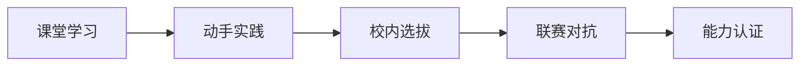

# 海淀区中学落地案例

## 案例背景

海淀区作为全国教育高地，一直走在教育信息化与人工智能教育的前沿。2025 年，加速进化与海淀区教育系统合作，推动人形机器人进入中学课堂，并成功举办首届海淀区中学生人形机器人足球联赛。

## 实施方案

### 「课堂→实践→赛事」全链条模式

#### 第一阶段：课堂学习
- 将人形机器人编程纳入信息技术/通用技术课程
- 使用 Booster K1 作为教学平台
- 提供标准化课程资源与教师培训

#### 第二阶段：动手实践
- 学生以小组形式进行机器人编程实践
- 从基础运动控制到自主决策，循序渐进
- 教师引导 + 学生自主探索相结合

#### 第三阶段：联赛对抗
- 校内选拔赛选拔优秀队伍
- 参加海淀区中学生人形机器人足球联赛
- 3v3 对抗，全自主运行

## 覆盖规模

| 指标 | 数据 |
|------|------|
| 海淀区内参与学校 | 38+ 所中学 |
| 区外参与学校 | 近 10 所 |
| 覆盖学段 | 初中、高中 |
| 竞赛平台 | Booster K1 |

## 实施效果

- **课程升级**：人形机器人从「遥不可及的概念」变为「课堂可操作的工具」
- **兴趣激发**：学生对人形机器人与 AI 技术的学习兴趣显著提升
- **能力培养**：编程能力、算法思维、团队协作能力全面提升
- **赛事热度**：首届联赛获得师生广泛参与与积极反馈

## 复制推广

海淀模式已向多个区域推广：

- **模式提炼**：「课堂→实践→赛事」全链条具备高度的可复制性
- **课程标准化**：课程资源与教师培训体系可快速输出至其他区域
- **区域适配**：根据不同区域的教育资源与需求进行灵活调整
- **持续扩展**：多个区域已表达合作意向，正在推进落地

## 案例启示

1. **赛事是最好的学习驱动**：对抗性赛事能极大激发学生内驱力
2. **降低门槛是关键**：统一硬件平台与标准化课程使大规模推广成为可能
3. **教师培训是保障**：教师能力提升是项目持续运营的核心
4. **全链条模式具有强复制性**：课堂→实践→赛事的闭环可在不同区域快速复制
