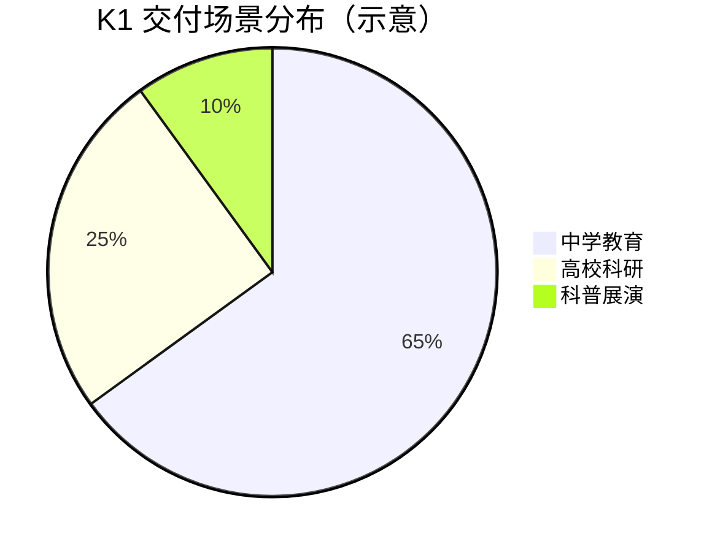

# 关键业务数据

本文档汇总加速进化科研教育业务的关键量化指标，用于销售材料、融资演示与内部汇报。

## 核心指标一览

| 指标 | 数据 | 截止时间 | 备注 |
|------|------|----------|------|
| K1 交付量 | 超千台 | 2025 年 | 面向教育场景的主力产品 |
| 海淀区覆盖学校 | 38+ 所中学 | 2025 年 | 含区外近 10 所学校 |
| 全球 T1 使用团队 | 50+ 顶级赛队与科研团队 | 2025 年 | 覆盖 RoboCup 等多个赛事 |
| RoboCup 冠军 | AdultSize + KidSize 双冠 | 2025 年 7 月 | 巴西世界杯 |
| 融资总额 | 亿元级 Pre-A + A 轮 + A+ 轮 | 2024–2025 年 | 多家顶级机构投资 |
| 福布斯 AI 科技 TOP50 | 北京唯一上榜具身智能公司 | 2025 年 5 月 | 福布斯中国 |

## 产品交付数据

## 赛事成绩数据

| 赛事 | 时间 | 成绩 |
|------|------|------|
| RoboCup German Open | 2025 年 3 月 | 清华火神 9:0 夺冠 |
| RoboCup 2025 世界杯 | 2025 年 7 月 | AdultSize 冠军 + KidSize 冠军/亚军 |
| 海淀联赛首届 | 2025 年 | 38+ 所学校参与 |
| RoBoLeague 首届 | 2025 年 6 月 | 国内首届 3v3 AI 赛 |

## 市场覆盖数据

| 维度 | 覆盖情况 |
|------|----------|
| 区域覆盖 | 以北京为核心，向全国多区域辐射 |
| 学段覆盖 | 中学（初中+高中）、高校（本科+研究生）、科研机构 |
| 场景覆盖 | 课堂教学、赛事竞技、科普展演、科研实验 |
| 国际覆盖 | RoboCup 全球赛队，德国、巴西等国际赛场 |

## 增长趋势

- **K1 交付量**：从 0 到超千台，持续增长
- **合作学校**：从海淀试点向全国复制推广
- **赛事体系**：从参与 RoboCup 到自办 RoBoLeague，赛事矩阵逐步完善
- **品牌影响力**：福布斯 AI TOP50 入选、RoboCup 官方合作伙伴

## 数据使用说明

- 以上数据用于对外宣传与内部决策参考
- 数据更新频率：季度更新
- 数据来源：内部业务系统、公开赛事成绩、媒体报道
- 对外使用时请确认数据时效性
