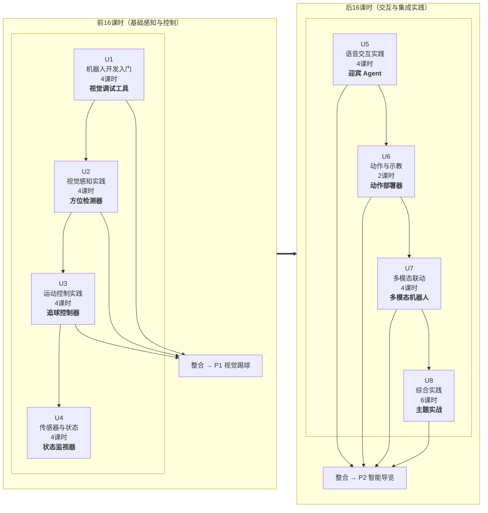

# X 课程大纲（v3.0）

> **代号**：X 课程（最终名称待定）
> - 人形机器人开发实训
> - 具身智能机器人实践
> - 
> **定位**：以 K1 机器人为载体、BoosterOS SDK 为核心的实训实操基础课
> 
> **总课时**：32 课时（16 次课 × 2 课时/次，每次 90 分钟）


---

## 一、课程定位

### 1.1 在课程体系中的位置

```
通识理论课    →    数采课程(具身智能基础)  →   X课程(本课程)   →   Z课程(AgentFramework)
(AI/具身智能      (采集/标注/训练            (BoosterOS SDK     (Agent开发框架,
 概念普及)         全链路)                   实训实操基础)        真正的应用开发)
```

### 1.2 顶层目标

1. **衔接前置（非必须前置）**：把“具身通识理论课（任意专业必修）”中的抽象概念（计算机视觉、运动控制、传感器、语音等）通过 K1 实操具象化
2. **SDK 能力全覆盖**：以 BoosterOS SDK 为核心，系统性练习 K1 的各类接口
3. **综合轻量多任务**：每单元一个轻量项目，最终整合为两个综合实践主题（视觉踢球 + 智能导览）

### 1.3 设计原则

- **偶数课时**：每单元 2/4/6 课时，匹配 90 分钟连排课
- **双主线**：每单元明确"具身智能知识线 + 技能/应用线"
- **前后可拆**：前 16 课时（U1-U4）可独立开课，后 16 课时（U5-U8）可续接

### 1.4 先修假设

- 学生已完成「具身智能通识 / AI 通识」等理论课程（了解基本概念词汇）  --  （非必须）
- 学生已具备 Python 基础、Linux 基础操作能力  --  （非必须）
- 学生**未**接触过 K1 机器人（U1 承担 SDK 入门任务）

---

## 二、课程总览

| 单元     | 标题       | 课时     | 课时占比     | 小项目产出      | SDK 能力覆盖        |
| ------ | -------- | ------ | -------- | ---------- | --------------- |
| U1     | 机器人开发入门  | 4      | 12.5%    | 视觉调试工具     | 连接/信息/模式/图像采集   |
| U2     | 视觉感知实践   | 4      | 12.5%    | 方位检测器      | 目标检测/结果解析       |
| U3     | 运动控制实践   | 4      | 12.5%    | 追球控制器      | 速度控制/头部控制/步态    |
| U4     | 传感器与状态监测 | 4      | 12.5%    | 状态监视器      | IMU/里程计/电池/摔倒检测 |
| U5     | 语音交互实践   | 4      | 12.5%    | 迎宾语音Agent  | ASR/TTS/LLM对话   |
| U6     | 动作与示教    | 2      | 6.25%    | 动作部署器      | 示教/轨迹/预定义动作     |
| U7     | 多模态联动    | 4      | 12.5%    | 迎宾接待员      | 多传感器+检测+运动+语音   |
| U8     | 综合实践     | 6      | 18.75%   | 踢球/导览/自由主题 | 全能力综合           |
| **合计** |          | **32** | **100%** |            |                 |



---

## 三、各单元详细设计

### U1：机器人开发入门（4课时）

> **定位**：学生第一次接触 K1。建立"机器人系统→ROS2通信→传感器全貌"的完整认知。
> **具象化锚点**：「机器人系统架构」「ROS2 通信」「传感器数据类型」

| 课时    | 主题       | 具身智能知识线                                                                                    | 编程/应用线                                                                    | 核心概念                                                  | 轻量概念              | 轻任务                                                                                                          |
| ----- | -------- | ------------------------------------------------------------------------------------------ | ------------------------------------------------------------------------- | ----------------------------------------------------- | ----------------- | ------------------------------------------------------------------------------------------------------------ |
| **1** | 认识 K1    | 人形机器人系统组成：感知(相机/IMU) → 计算(机载计算机) → 运动(关节/电机) → 电源                                          | `pip install boosteros` → `BoosterRobot()` → 连接验证                         | **SDK(E06)**：操作机器人的统一入口                               | 关节状态(A10)         | ① 连接K1，打印`robot_info`，快速浏览`list_joints()`和`list_actions()`                                                   |
| **2** | ROS2通信基础 | 为什么需要 ROS2——多进程通信需求。**类比：快递系统**——发布方填快递单(话题)，快递员投递(消息)，订阅方根据单号收件                           | `ros2 topic list` / `echo` / `hz` / `info` 四件套                            | **节点(C01)+话题(C02)+发布(C03)+订阅(C04)+消息(C05)**：ROS2通信五元组 | 事件循环(E02)+回调(E01) | ② 在K1终端执行：`ros2 topic list` → `ros2 topic hz /camera/image_raw` → `ros2 topic echo /camera/image_raw --once` |
| **3** | 传感器速览    | 从话题视角理解 K1 传感器体系：相机(`/camera/image_raw`)、IMU(`/imu/data`)、里程计(`/odom`)、关节(`/joint_states`) | `subscribe_image()` 本质是创建了 ROS2 订阅者，每来一帧自动调回调函数。消息类型决定数据字段                | 消息类型(`sensor_msgs/Image`, `sensor_msgs/Imu` 等)        | —                 | ③ **传感器速览**：用SDK快照接口依次采集4种传感器，打印关键信息（图像尺寸、RPY、关节数、电量%）                                                       |
| **4** | 模式与安全    | 机器人运行模式：damping(零力矩)/prepare(站立)/walk(行走)，安全规范（STAND确认、模式优先级）                              | `set_mode("prepare")` → `set_mode("walk")` → `set_mode("damping")`，观察状态变化 | **终端调试(E07)**：print/log是第一调试手段                        | 参数(C08)轻量引入       | ④ **模式切换练习**：damping→prepare→walk→damping，记录每个模式特征                                                           |

**单元产出**：机器人信息报告 + ROS2 CLI 操作记录 + 传感器速览截图 + 模式切换脚本

---

### U2：视觉感知实践（4课时）

> **定位**：建立"机器人视觉≠图片观赏，而是从图像中提取结构化信息"的认知。
> **具象化锚点**：「计算机视觉」（目标检测、置信度、检测框）

| 课时 | 主题 | 具身智能知识线 | 编程/应用线 | 核心概念 | 轻量概念 | 轻任务 |
|---|---|---|---|---|---|---|
| **1** | 机器人"眼睛" | 相机话题、RGB vs 深度图、图像编码格式（NV12/BGR8） | `subscribe_image()`、回调中保存图像帧 | — | 图像坐标系(A04)：左上角(0,0)，x→右，y→下；**CvBridge(E05)**：ROS消息↔OpenCV图像的桥梁 | ① 订阅K1相机图像流，实时显示，按快捷键保存当前帧 |
| **2** | 目标检测入门 | 目标检测概念（模型输入→推理→输出检测框），不涉及训练原理 | `Detection(model="soccer_yolo")` → `.detect()` 调用 | **YOLO检测(A01)+检测框(A03)**：模型"圈出"目标的位置和类别 | — | ② 加载检测模型，对保存的图像执行检测，打印JSON结果 |
| **3** | 置信度与多目标 | 置信度的含义：模型有多"确信"这个目标是真的；多目标选择策略 | JSON提取：`class_name`、`confidence`、`bbox`；阈值筛选 | **置信度(A02)+归一化(A06)**：坐标从像素值缩放到0-1区间，不依赖分辨率 | — | ③ **置信度实验**：设置 confidence=0.3/0.5/0.7，对比同一图像检测结果 |
| **4** | 方位检测器 | 从检测框到方位判断：bbox中心→画面比例→三段式判断 | 坐标-比例换算、函数封装——输入检测结果，输出结构化信息 | **主动感知(B04)**：机器人通过移动/转头来获取更好视角 | — | ④ **方位检测器**：输出 `(类别, 方位, 远近, 置信度)` |

**单元产出**：图像采集脚本 + 检测调用脚本 + 方位检测器

---

### U3：运动控制实践（4课时）

> **定位**：建立"感知→控制闭环"概念——看到球→知道往哪走→控制运动去追。这是前16课时的核心。
> **具象化锚点**：「机器人控制」「闭环控制」「PID控制思想」

| 课时    | 主题      | 具身智能知识线                               | 编程/应用线                                                                   | 核心概念                                                          | 轻量概念                          | 轻任务                                                     |
| ----- | ------- | ------------------------------------- | ------------------------------------------------------------------------ | ------------------------------------------------------------- | ----------------------------- | ------------------------------------------------------- |
| **1** | K1的基本运动 | 运动模型：`vx/vy/vyaw` 速度控制、机器人坐标系定义       | `set_velocity(vx, vy, vyaw)` → 前进/后退/左转/右转实验                             | **闭环vs开环(B09)**：开环=发指令不管结果，闭环=看结果调整；**偏差(A05)**：目标位置−当前位置     | Pitch(A08)/Yaw(A09)：低头抬头/左右转头 | ① **基本运动实验**：前进1m/s走2秒→后退→转向，观察K1运动轨迹                   |
| **2** | 头部与步态   | 头部控制与视野；步态对运动效率和稳定性的影响                | `set_head_angle(pitch, yaw)` → 边走边扫描；`set_gait("soccer")` vs `"default"` | —                                                             | —                             | ② 组合运动：边走边转头扫描；③ 足球步态 vs 默认步态对比                         |
| **3** | 感知→控制闭环 | 从"看到球"到"追上去"：方位偏差→转向速度→前进速度的映射关系      | 方位检测器输出 → 计算 `vyaw = Kp × error_x` → `set_velocity(vx, 0, vyaw)`         | **P控制(B01)**：转向速度∝偏差大小，偏得越多转得越快；**感知-行动耦合(B03)**：边看边动，不是先看完再动 | —                             | ④ **追球初体验**：放球→检测→转向对准→前进→重复循环                          |
| **4** | 停稳与调参   | 停稳条件设计：`stop_dist` + 确认帧数；迟滞原理：防止抖动反复 | 参数配置化、一次只改一个参数、记录对比                                                      | **低通滤波(B02)**：检测结果和之前做平滑，避免抖动                                 | —                             | ⑤ **参数调优实验**：改变 stop_dist(0.5/0.78/1.0)和hysteresis，记录对比 |

**单元产出**：基本运动脚本 + 追球控制脚本 + 参数调优记录

---

### U4：传感器与状态监测（4课时）

> **定位**：补充 K1 的"感知自身"能力——IMU、里程计、电池、摔倒检测。这些是前16课时传感器线的收尾。
> **具象化锚点**：「IMU/惯性导航」「里程计」「机器人状态管理」

| 课时    | 主题      | 具身智能知识线                             | 编程/应用线                                       | 核心概念                                     | 轻量概念                                  | 轻任务                                       |
| ----- | ------- | ----------------------------------- | -------------------------------------------- | ---------------------------------------- | ------------------------------------- | ----------------------------------------- |
| **1** | IMU姿态实验 | IMU原理：加速度计+陀螺仪→姿态融合→RPY             | `get_imu()` → `rpy`(Roll/Pitch/Yaw)、线加速度、角速度 | —                                        | 参数(C08)：可配置的控制量（深入讲解 parameter 概念）    | ① **姿态实验**：手持K1缓慢倾斜，观察RPY曲线变化（打印/简单绘图）    |
| **2** | 里程计实验   | 里程计原理：编码器积分→位置估计；漂移问题是所有轮式/足式机器人的共性 | `get_odom()` → `pose_2d`(x,y,yaw)、线速度、角速度    | **TF坐标变换(A11)**：odom坐标系→机器人坐标系，不同坐标系间的转换 | 定时器(C09)：周期性回调（ros2 timer），用于持续记录里程数据 | ② **里程实验**：让K1直线走2m，对比指令距离vs里程计读数，观察漂移    |
| **3** | 状态监测    | 电池管理、摔倒检测（K1的前倾/后仰安全机制）             | `get_battery()`、`get_fall_down_state()`、循环监控 | —                                        | —                                     | ③ **状态监视器**：实时显示电池%/摔倒状态/当前模式             |
| **4** | 传感器驱动行为 | 多个传感器数据综合判断（电池低+摔倒→需要人工干预）          | 摔倒→`get_up()`、低电量→告警，定时器驱动循环                 | **多传感器融合(B08)**：IMU+里程计+电池+摔倒，综合判断而非各看各的 | —                                     | ④ **安全守护者**：持续监控，摔倒时自动调用get_up()，电池<20%告警 |

**单元产出**：IMU姿态报告 + 里程误差记录 + 状态监视器 + 安全守护脚本

---

### U5：语音交互实践（4课时）

> **定位**：引入 K1 的语音-语言能力，建立"语音交互闭环"概念。这是后16课时的新领域入口。
> **具象化锚点**：「语音识别(ASR)」「语音合成(TTS)」「大语言模型(LLM)」「人设/角色扮演」

| 课时 | 主题 | 具身智能知识线 | 编程/应用线 | 核心概念 | 轻量概念 | 轻任务 |
|---|---|---|---|---|---|---|
| **1** | 语音识别入门 | ASR概念（声波→文本）；流式识别vs整句识别；延迟对交互体验的影响 | `start_recording()` → `stop_recording()` → `recognize_stream()` | **QoS(E03)**：音频流对延迟敏感，ROS2 QoS配置决定通信可靠性/延迟权衡 | — | ① **我是翻译官**：录制一句话→ASR识别→打印原文对比 |
| **2** | 语音合成 | TTS概念（文本→语音）；音色对用户体验的影响 | `play_stream()` → 音色列表 `list_voices()`；不同音色播放 | **服务(C06)+动作Action(C07)**：对比话题(pub/sub)的单向性，引入请求-响应和带反馈任务两种新模式 | — | ② **K1播音员**：输入文字→选择不同音色→播放，对比效果 |
| **3** | LLM对话 | LLM概念（类比例子说明，不涉及Transformer原理）；LLM的能力和边界 | `Speech.chat(config=ChatConfig(system_prompt=...))` | — | — | ③ **人设实验**：设计3种system_prompt（解说员/科普老师/迎宾员），问同一个问题，对比回复差异 |
| **4** | 语音交互闭环 | ASR→LLM→TTS三阶段端到端链路；延迟测量 | 录制→识别→LLM回复→TTS播放，测量全过程延迟 | **状态机(B05)**：用FSM管理对话状态流转（待机→聆听→处理→回答→待机） | — | ④ **语音问答机器人**：对着K1说话→K1用设定人设语音回答，测延迟 |

**单元产出**：ASR测试记录 + 3种人设对比报告 + 语音问答脚本

---

### U6：动作与示教（2课时）

> **定位**：前置数采课程已覆盖采集/清洗/标注/训练全链路，本单元聚焦"把模型用起来"——部署+编排。内容紧凑，2课时一次课完成。
> **具象化锚点**：「模仿学习」「动作规划」「机器人轨迹」

| 课时    | 主题    | 具身智能知识线                                                                          | 编程/应用线                                                                                                                                                                    | 核心概念 | 轻量概念                                    | 轻任务                                                   |
| ----- | ----- | -------------------------------------------------------------------------------- | ------------------------------------------------------------------------------------------------------------------------------------------------------------------------- | ---- | --------------------------------------- | ----------------------------------------------------- |
| **1** | 回顾与部署 | **回顾**（10min）：动作数据链路——示教→CSV→NPZ→训练→模型；"数据驱动"vs"规则驱动"对比；**部署实践**：使用预训练模型在K1上执行动作 | `hand_guiding_manager` → 零力矩拖拽 → `start_recording()` → `stop_recording()` → `TrajectoryData.save()`；`execute_trajectory()` 回放；`do_action()` 预定义动作（hand_shake/kick/dance等） | —    | 行为树(B06)：比FSM更灵活的行为组织方式，5min概念引入，为Z课程埋点 | ① **动作回放**：拖拽录制一个简单动作→保存.traj→回放验证；② 调用3种预定义动作，观察效果差异 |
| **2** | 动作编排  | 动作在应用场景中的角色——不是独立表演，而是场景行为的一部分（如迎宾：检测→挥手→鞠躬→引导）                                  | Python顺序调用执行3-5步动作序列                                                                                                                                                      | —    | —                                       | ③ **机器人礼仪操**：设计一个动作序列（如挥手→鞠躬→挥手），真机执行+录视频             |

**单元产出**：录制的.traj文件 + 动作序列脚本 + 演示视频

---

### U7：多模态联动（4课时）

> **定位**：整合前6个单元的独立能力，走向"多传感器+多能力联动"。是U8综合实践的前置预演。
> **具象化锚点**：「多传感器融合」「事件驱动」「多线程/异步」

| 课时    | 主题          | 具身智能知识线                                                            | 编程/应用线                                                                    | 核心概念                                                      | 轻量概念 | 轻任务                                         |
| ----- | ----------- | ------------------------------------------------------------------ | ------------------------------------------------------------------------- | --------------------------------------------------------- | ---- | ------------------------------------------- |
| **1** | 多传感器同时订阅    | 多传感器时序对齐——相机30Hz、IMU 100Hz、里程计 50Hz，不同频率如何协同                       | 同时 `subscribe_image()` + `subscribe_imu()` + `subscribe_odom()`，在回调中打印时间戳 | —                                                         | —    | ① **传感器时间对齐**：同时订阅3种传感器，打印各传感器最新数据时间戳，观察偏差  |
| **2** | 视觉-运动桥接（复习） | U2+U3 深度复习：检测→方位判断→速度映射→停稳，完整闭环再走一遍                                | 整合U2检测器+U3追球器，新增U4的摔倒保护（摔倒时中止运动）                                          | —                                                         | —    | ② **追球2.0**：检测→追球→停稳+摔倒保护，完整闭环              |
| **3** | 语音-运动桥接     | 语音指令→运动控制的映射设计（"前进"→`set_velocity(0.5, 0, 0)`）；指令数量限制（5个以内，避免复杂字典） | ASR识别文本→关键词提取→`set_velocity()`                                            | **Launch File(E04)**：一键启动多节点（检测+运动+语音+监控），替代手动 `ros2 run` | —    | ③ **语音遥控器**：识别"前进/后退/左转/右转/停止"，控制K1运动，含限速保护 |
| **4** | 迎宾接待员       | 多模态整合：检测到人→转向面向人→语音打招呼→听取指令→执行                                     | 检测线程+对话线程+运动线程协作（多线程基础模式）；全程日志记录                                          | —                                                         | —    | ④ **迎宾接待员Demo**：检测到人脸→用迎宾人设打招呼→听取指令执行，含完整日志 |

**单元产出**：传感器时间对齐报告 + 追球2.0脚本 + 语音遥控器 + 迎宾接待员Demo

---

### U8：综合实践（6课时）

> **定位**："任务集市"模式。每组从3个预置主题中选择1个，6课时完成并展示。考察概念理解+工程整合+演示表达。

#### 可选主题

| 主题 | 整合能力 | 难度 | 任务描述 |
|---|---|---|---|
| **A. 智能踢球** | U2检测+U3运动+U4状态 | ⭐⭐ | 检测→追球→停稳→踢球（`SoccerKickManager`），含摔倒保护 |
| **B. 智能导览** | U2检测+U5语音+U6动作+U7多模态 | ⭐⭐⭐ | 检测到人→打招呼→语音介绍展品→动作指引，3展品循环 |
| **C. 传感器数据采集器** | U1快照+U4订阅+U7时间对齐 | ⭐ | 同时采集图像+IMU+里程计，按帧保存，输出CSV数据日志+简易可视化 |

#### 课时拆解

| 课时 | 内容 | 产出 |
|---|---|---|
| **1** | 选题、任务拆解、接口梳理、模块分工 | 任务分配表 + 模块接口约定 |
| **2** | 核心模块开发（分组并行） | 各模块代码 |
| **3** | 真机测试 + 参数优化 | 真机运行视频 + 参数记录 |
| **4** | 代码整理 + 文档撰写 | 项目文档（方案/架构图/参数记录/问题记录） |
| **5** | 演示准备 + 组内演练 | 演示脚本 + PPT |
| **6** | **成果展示会**：每组 5min 真机演示 + 3min 答辩（含概念抽查） | 评分 + 反馈 |

#### 评价维度

| 维度 | 权重 | 标准 |
|---|---|---|
| 功能完成度 | 30% | 核心功能在真机上可运行 |
| 概念理解 | 20% | 答辩时随机抽2个本组用到的概念，用实际案例解释 |
| 工程组织 | 20% | 代码结构清晰、模块分工合理、有接口约定 |
| 文档质量 | 15% | 架构图/流程图/参数记录/问题记录完整 |
| 演示表达 | 15% | 真机演示流畅、答辩表达清楚 |

---

## 四、前后 16 课时拆分

| 维度 | 前16（U1-U4） | 后16（U5-U8） |
|---|---|---|
| **主题** | 感知与控制基础 | 交互与集成实践 |
| **SDK覆盖** | `BoosterRobot`核心类：连接/信息/传感器快照/检测/运动/IMU/里程计/状态 | 语音(ASR/TTS/LLM)/示教/多传感器联动/综合实践 |
| **ROS2覆盖** | 通信五元组（集中）+ 定时器 + 参数 | 服务 + Action + Launch File |
| **独立开课** | 可作为「K1机器人感知与控制基础」独立开课（自包含，U1连接K1即可开始） | 可作为「K1机器人交互与集成实践」续接课程（需前16基础或等效经验） |
| **具象化概念** | 机器人系统、计算机视觉、运动控制、传感器 | 语音处理、对话状态机、动作编排、多模态 |
