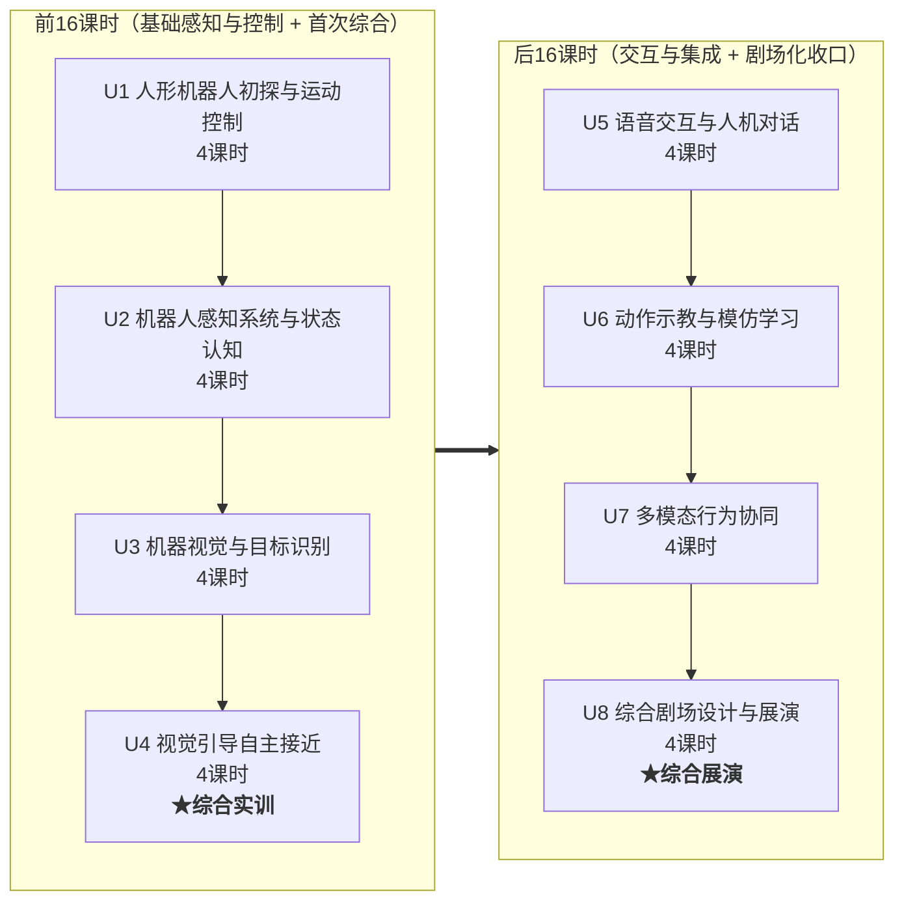

# X 课程大纲（v4.0）

> **代号**：X 课程（最终名称待定）
> - 具身智能应用与开发
> - 人形机器人开发实训
> - 具身智能机器人实践
>
> **定位**：以 K1 机器人为载体、BoosterOS SDK 为核心的实训实操基础课
>
> **总课时**：32 课时（8 单元 × 4 课时/单元，每单元 2 次课 × 90 分钟连排）
>
> **v4 主要变更**：
> 1. **单元重新排序并均一化**：8 单元统一为每单元 4 课时（原 v3 为 2/4/6 不等）。
> 2. **U2 前置为「机器人感知系统与状态认知 + ROS2 通信基础」**，把原 U1 的 ROS2/传感器内容下沉，并为 U4 融合控制预埋传感基础。
> 3. **U3 机器视觉与目标识别**承接原 v3 的视觉单元；U4 升级为**视觉引导自主接近（多传感融合综合实训）**，引入「闭环/反馈控制」新主线。
> 4. **U6 扩展为 4 课时「动作示教与模仿学习」**，补齐挂起的数采课程缺口（概念 + 教师演示，SDK 无训练接口）。
> 5. **U7 重构为「多模态行为协同（面向小剧场预演）」**，U8 定为 **4 课时「综合剧场设计与展演」**，形成后 16 课时的剧场化收口。
> 6. **明确不引入 ArUco/OpenCV 二维码库**：视觉定位由「检测框 + 里程计 + IMU」三传感融合完成，第三方库仅在可选扩展中提及。

---

## 一、课程定位

### 1.1 在课程体系中的位置

```
通识理论课         →    数采课程(具身智能基础,挂起)  →   X课程(本课程)          →   Z课程(AgentFramework)
(具身智能/AI概念)     (采集/标注/训练全链路)            (BoosterOS SDK          (Agent开发框架,
                                                      实训实操基础)             真正的应用开发)
```

> 数采课程当前挂起，其「采集→训练」全链路缺口由 **U6 动作示教与模仿学习** 以「概念 + 教师演示」方式补位（SDK 不提供训练接口，训练在 BeyondMimic / Isaac Lab 完成，预训练模型由教师端提供）。

### 1.2 顶层目标

1. **衔接前置（非必须前置）**：把「具身通识理论课」的抽象概念（计算机视觉、运动控制、传感器、语音等）通过 K1 实操具象化。
2. **SDK 能力全覆盖**：以 BoosterOS SDK 为核心，系统性练习 K1 的各类接口。
3. **双阶段、双综合**：前 16 课时（U1–U4）建立「感知—控制」基础并完成**第一个综合实训（U4 视觉引导自主接近）**；后 16 课时（U5–U8）进入「交互—集成」并完成**剧场化综合实践（U8 综合剧场设计与展演）**。
4. **轻任务、多实践**：每单元一个轻量项目，U4 与 U8 为两个综合性验收节点。

### 1.3 设计原则

- **均一课时**：每单元 4 课时，匹配 90 分钟连排课，便于「2 次课完成一个单元」。
- **双主线**：每单元明确「具身智能知识线 + 技能/应用线」。
- **前后可拆**：前 16 课时（U1–U4）可独立开课，后 16 课时（U5–U8）可续接。
- **新知识随综合项目引入**：U4 引入「闭环/反馈控制」作为全新知识脊柱，串联视觉伺服、多传感融合、标定。
- **行业/职业认知融入**：在知识线中设置可选「行业/职业认知」了解模块（轻量、不占主课时），帮助学生建立"所学即所用"的岗位连接。主要锚点：**U1 人形机器人产业与岗位地图 → U4 机器人应用开发工程师职责 → U8 智能服务机器人行业趋势与职业路径**，三个锚点首尾呼应形成一条认知线。

### 1.4 先修假设

- 学生已完成「具身智能通识 / AI 通识」等理论课程（了解基本概念词汇） ——（非必须）
- 学生已具备 Python 基础、Linux 基础操作能力 ——（非必须）
- 学生**未**接触过 K1 机器人（U1 承担 SDK 入门任务）

---

## 二、课程总览

| 单元     | 标题                 | 课时     | 占比        | 小项目产出               | SDK 能力覆盖                    | 阶段         |
| ------ | ------------------ | ------ | --------- | ------------------- | --------------------------- | ---------- |
| U1     | 人形机器人初探与运动控制       | 4      | 12.5%     | 模式/运动调试工具           | 连接/信息/模式/速度/头部/步态/预定义动作     | 前16·基础     |
| U2     | 机器人感知系统与状态认知       | 4      | 12.5%     | ROS2 CLI 操作 + 状态监视器 | ROS2 通信五元组/相机/IMU/里程计/电池/摔倒 | 前16·基础     |
| U3     | 机器视觉与目标识别          | 4      | 12.5%     | 方位检测器               | 目标检测/结果解析/置信度/多目标           | 前16·基础     |
| **U4** | **视觉引导自主接近（综合实训）** | **4**  | **12.5%** | **「接待员机器人」综合项目**    | **检测框 + 里程计 + IMU 三传感融合闭环** | **前16·综合** |
| U5     | 语音交互与人机对话          | 4      | 12.5%     | 迎宾语音 Agent          | ASR/TTS/LLM 对话              | 后16·交互     |
| U6     | 动作示教与模仿学习          | 4      | 12.5%     | 动作采集器 + 动作序列        | 示教/录制/回放/预定义动作/数据链路         | 后16·交互     |
| U7     | 多模态行为协同            | 4      | 12.5%     | 小剧场预演脚本             | 多传感器订阅/视觉-运动-语音桥接/多线程       | 后16·集成     |
| U8     | 综合剧场设计与展演          | 4      | 12.5%     | 小剧场展演               | 全能力综合编排                     | 后16·集成     |
| **合计** |                    | **32** | **100%**  |                     |                             |            |



---

## 三、各单元详细设计

### U1：人形机器人初探与运动控制（4课时）

> **定位**：学生第一次具身智能的实体机器人开发，本单元将建立“具身智能→人形机器人→应用”的知识线以及“机器人基本结构→机器人连接→执行器开环控制”的实操活动。本单元为**开环**操作（发指令、看结果），初步建立机器人操作的基本认知，并将与 U4 的「闭环」形成对照。
> **知识锚点**：「具身智能橄榄」「机器人结构」「执行器控制」「开环操作」
> **注**：U1-L1 实验代码包已交付（`实验代码/U1-L1_K1连接与信息/`）。

| 课时    | 主题             | 具身智能知识线                                           | 编程/应用线                                                                                                         | 核心概念                                        | 轻量概念                         | 轻任务                                           |
| ----- | -------------- | ------------------------------------------------- | -------------------------------------------------------------------------------------------------------------- | ------------------------------------------- | ---------------------------- | --------------------------------------------- |
| **1** | 具身智能概览 + 连接 K1 | 人形机器人系统组成：感知→计算→运动→电源；具身智能定义                      | `pip install boosteros` → `BoosterRobot()` → 连接验证；`robot_info`/`list_joints()`/`list_actions()`                | **SDK(E06)**：操作机器人的统一入口                     | 关节状态(A10)                    | ① 连接 K1，打印 `robot_info`，浏览关节与动作列表             |
| **2** | 运行模式与安全        | 机器人运行模式：damping/prepare/walk；安全规范（STAND 确认、模式优先级） | `set_mode("prepare")` → `set_mode("walk")` → `set_mode("damping")`                                             | **终端调试(E07)**：print/log 是第一调试手段             | 参数(C08)轻量引入                  | ② 模式切换练习：damping→prepare→walk→damping，记录各模式特征 |
| **3** | 基本运动控制         | 运动模型：`vx/vy/vyaw` 速度控制；机器人坐标系定义                   | `set_velocity(vx, vy, vyaw)` → 前进/后退/左转/右转实验                                                                   | **偏差(A05)**：目标位置 − 当前位置；**开环(B09)**：发指令不管结果 | Pitch/Yaw(A08/A09)：低头抬头/左右转头 | ③ 基本运动实验：前进 1m/s 走 2 秒→后退→转向，观察轨迹             |
| **4** | 头部、步态与预定义动作    | 头部控制与视野；步态对效率/稳定性的影响；预定义动作库                       | `set_head_angle(pitch, yaw)`（walk 模式）→ 边走边扫描；`set_gait("soccer")` vs `"default"`；`do_action("wave"/"bow"/...)` | —                                           | —                            | ④ 组合运动：边走边转头扫描；⑤ 足球步态 vs 默认步态对比；⑥ 调用 3 种预定义动作 |

**单元产出**：机器人信息报告 + 模式切换脚本 + 基本运动脚本 + 头部/步态/动作演示记录

> 💡 **行业/职业认知（可选了解模块）**：人形机器人产业现状与典型岗位地图（本体厂商研发 / 系统集成 / 应用开发 / 运维实施），建立"学这门课将来能干什么"的初步认知。

---

### U2：机器人感知系统与状态认知（4课时）

> **定位**：围绕具身智能「感知自身」和 ROS2 通信基础进行设计。本单元对传感器采取**监测/观测**视角（读懂数据含义），为 U4 的「用传感器做控制」铺垫——U2 看数据，U4 用数据。
> **知识锚点**：「ROS2 通信」「IMU/惯性」「里程计」「机器人状态管理」

| 课时    | 主题           | 具身智能知识线                                              | 编程/应用线                                                                  | 核心概念                                                              | 轻量概念              | 轻任务                                                                |
| ----- | ------------ | ---------------------------------------------------- | ----------------------------------------------------------------------- | ----------------------------------------------------------------- | ----------------- | ------------------------------------------------------------------ |
| **1** | ROS2 通信基础    | 为什么需要 ROS2——多进程通信需求（类比：快递系统，发布方填单/快递员投递/订阅方收件）       | `ros2 topic list` / `echo` / `hz` / `info` 四件套                          | **节点(C01)+话题(C02)+发布(C03)+订阅(C04)+消息(C05)**：ROS2 通信五元组            | 事件循环(E01)+回调(E02) | ① K1 终端：`ros2 topic list` → `hz /camera/image_raw` → `echo --once` |
| **2** | 传感器速览        | 从话题视角理解 K1 传感器体系：相机/IMU/里程计/关节                       | `subscribe_image()` 本质创建 ROS2 订阅者；SDK 快照接口依次采集 4 类传感器                   | 消息类型(`sensor_msgs/Image`, `sensor_msgs/Imu`, `nav_msgs/Odometry`) | —                 | ② 传感器速览：依次采集并打印图像尺寸、RPY、位置、电量%                                     |
| **3** | IMU 与里程计（观测） | IMU 原理：加速度计+陀螺仪→姿态融合→RPY；里程计原理：编码器积分→位置估计；漂移是足式机器人共性 | `get_imu()` → `rpy`；`get_odom()` → `pose_2d`(x,y,yaw)；`reset_odom()` 清零 | **坐标变换(A11)**：odom 坐标系→机器人坐标系                                     | 定时器(C09)：周期性回调记录  | ③ 姿态实验：手持缓慢倾斜看 RPY 变化；④ 里程实验：直线走 2m，对比指令距离 vs 里程计读数（观察漂移）          |
| **4** | 状态监测与融合      | 电池管理、摔倒检测（前倾/后仰安全机制）；多传感器综合判断                        | `get_battery()`、`get_fall_down_state()`；摔倒→`get_up()`、低电量→告警，定时器驱动循环    | **多传感器融合(B08)**：综合判断而非各看各的                                        | —                 | ⑤ 状态监视器：实时显示电池%/摔倒状态/当前模式；⑥ 安全守护者：摔倒自动 `get_up()`，电量<20% 告警        |

**单元产出**：ROS2 CLI 操作记录 + 传感器速览截图 + IMU 姿态报告 + 里程误差记录 + 安全守护脚本

---

### U3：机器视觉与目标识别（4课时）

> **定位**：建立「机器人视觉 ≠ 图片观赏，而是从图像中提取结构化信息」的认知。本单元只做**感知**（看见并理解检测框），**不触发运动**——与 U4「据所见去行动」形成明确分界。
> **知识锚点**：「计算机视觉」（目标检测、置信度、检测框）

| 课时    | 主题      | 具身智能知识线                           | 编程/应用线                                        | 核心概念                                    | 轻量概念                                                           | 轻任务                                     |
| ----- | ------- | --------------------------------- | --------------------------------------------- | --------------------------------------- | -------------------------------------------------------------- | --------------------------------------- |
| **1** | 机器人"眼睛" | 相机话题、RGB vs 深度图、图像编码格式（NV12/BGR8） | `subscribe_image()`、回调中保存图像帧                  | —                                       | 图像坐标系(A04)：左上角(0,0)，x→右，y→下；**CvBridge(E05)**：ROS 消息↔OpenCV 图像 | ① 订阅相机图像流实时显示，按快捷键保存当前帧                 |
| **2** | 目标检测入门  | 目标检测概念（模型输入→推理→输出检测框），不涉及训练原理     | `Detection(model="default")` → `.detect()` 调用 | **YOLO 检测(A01)+检测框(A03)**：模型"圈出"目标位置与类别 | —                                                              | ② 加载检测模型，对保存图像执行检测，打印 JSON 结果           |
| **3** | 置信度与多目标 | 置信度含义；多目标选择策略                     | JSON 提取：`class_name`/`confidence`/`bbox`；阈值筛选 | **置信度(A02)+归一化(A06)**：坐标缩放到 0–1，不依赖分辨率  | —                                                              | ③ 置信度实验：confidence=0.3/0.5/0.7 对比同一图像结果 |
| **4** | 方位检测器   | 从检测框到方位判断：bbox 中心→画面比例→三段式判断      | 坐标-比例换算、函数封装——输入检测结果，输出结构化信息                  | **主动感知(B04)**：机器人通过移动/转头获取更好视角          | —                                                              | ④ 方位检测器：输出 `(类别, 方位, 远近, 置信度)`          |

**单元产出**：图像采集脚本 + 检测调用脚本 + 方位检测器

---

### U4：视觉引导自主接近（4课时）★ 综合实训

> **定位**：**前三单元之后的第一个综合性项目**。把 U1（运动控制）、U2（感知与状态）、U3（机器视觉）串成一个综合性实践任务。同时引入**新知识——闭环 / 反馈控制**：前 3 单元全是开环视角（U1 发指令不管结果、U2 只读不控、U3 只识别不行动），U4 第一次让学生体验「感知→决策→执行→再感知」的闭环思想。
> **知识锚点**：「闭环 / 反馈控制」「多传感器融合」「视觉伺服」
> **定位与 U3 的边界**：U3 教「**看见**」（detect、bbox 含义）；U4 教「**据所见去行动**」（bbox 当控制量 + 融合 odom/IMU 做反馈）。

#### 📋 项目外壳：商业展厅迎宾导览行为模块开发（真实项目载体）

> 本单元以一个**真实岗位委托**为情境外壳，使综合实训具备"真实项目"属性（高职课程核心诉求：学生要感觉"我学的是上岗能干的真活"）。**实验代码逻辑完全不变**，仅赋予其行业身份与可量化验收标准，把"单元教学"升级为"项目交付"。

- **项目背景（客户委托）**：某科技展厅委托开发 K1 人形机器人的「主动迎宾导览」行为模块——来宾进入展区时，机器人应自主感知、主动接近、礼貌致意并简要介绍。对应岗位：**机器人应用开发工程师**。
- **需求拆解 → 四课时映射**：
  - 转向对准（L1）：来宾不在正前方时，机器人需转向正对
  - 逼近停稳（L2）：接近至"舒适社交距离"约 **1.2 m**，不过近也不过远
  - 迎宾接近（L3）：对移动 / 不同位置的来宾稳定完成接近，不撞、不偏
  - 综合验收（L4）：完整"检测→转向→逼近→致意"行为链，可现场演示
- **量化验收标准（上岗考核口径）**：
  1. 来宾进入 3 m 内，机器人 **≤5 s** 完成转向对准（bbox 偏差 < 阈值）
  2. 逼近至 **1.2 ± 0.2 m** 舒适距离后自动停稳
  3. 触发语音问候 + 手势致意（复用 U1/U6 动作）
  4. 全程 **IMU 无异常侧倾 / 打滑**，异常则安全停止
  5. 里程计漂移导致偏差时，bbox 兜底修正生效
- **可选团队分工（轻任务）**：学生分组扮演真实协作——**感知组**（检测 / 方位）、**控制组**（转向 / 逼近闭环）、**集成组**（联调 / 验收），模拟机器人应用开发项目团队。

| 课时    | 主题                 | 具身智能知识线                                                | 编程/应用线                                                                | 核心概念                                                 | 轻量概念 | 轻任务                                                                  |
| ----- | ------------------ | ------------------------------------------------------ | --------------------------------------------------------------------- | ---------------------------------------------------- | ---- | -------------------------------------------------------------------- |
| **1** | 转向对准（视觉伺服）         | 视觉伺服思想：把图像特征（框偏差）直接当控制量；目标方位 = 当前航向 + K·(cx−W/2)       | bbox.center_x → `vyaw = Kp·error`；`odom.pose_2d[2]` 提供自身航向            | **P 控制(B01)**：转向速度∝偏差；**视觉伺服(B10)**：用图像特征做控制量        | —    | ① 双法对比：纯视觉框居中即停（"框居中却没真朝目标"）vs 视觉算方位 + odom yaw 闭环（真正朝目标）；正对前方不同位置目标 |
| **2** | 逼近与停稳（标定与漂移）       | 标定概念：bbox 面积↔距离是物体尺寸相关的，需对每物体一次标定；里程计漂移是足式机器人共性        | `reset_odom()` 清零 → walk 直到 `odom.pose_2d[0] ≈ d` → 停；bbox 是否在视野做修正兜底 | **标定(B11)**：用已知距离标定目标框大小；**传感局限(B12)**：传感器不可全信，需交叉验证 | —    | ② 实验：里程计法走定距，记录打滑漂移；③ 用 bbox 兜底修正停靠距离                                |
| **3** | 迎宾接近（开环 vs 闭环）     | 开环与闭环对比：开环脚本固定"转 1.2s+前进 3s"落点必偏；闭环三传感融合稳准；IMU 监测侧倾/打滑 | person 模型；bbox 方位→odom yaw 对准；odom 位移 + bbox 双判据逼近；IMU 角速度/加速度异常则停    | **开环 vs 闭环(B09)**：对比两类策略的落点误差                        | —    | ④ 开环基线：固定脚本接近，记录落点误差（必偏）；⑤ 闭环融合：稳定接近"客人"                             |
| **4** | 综合挑战：接待员机器人（小项目验收） | 整合前 3 课 + 复用 U1 动作；完整"检测→转向→逼近→致意"行为链                  | 检测来宾→转向对准→逼近到舒适距离→点头/挥手（`do_action`）                                  | **多传感器融合(B08)**：视觉+里程计+IMU 统一决策                      | —    | ⑥ 验收题「接待员机器人」；可选：多目标选最近（最大框）/ 人移动动态重定向                               |

**单元产出**：转向对准脚本 + 逼近停稳脚本 + 迎宾接近（开环/闭环对比）脚本 + **「接待员机器人」综合项目**（U4 验收）

> 💡 **行业/职业认知（可选了解模块）**：商业服务机器人（展厅 / 商场 / 酒店迎宾）是高职机器人专业真实就业方向；了解"机器人应用开发工程师"的岗位职责（需求拆解、SDK 集成、联调验收）与本单元任务高度一致。

---

### U5：语音交互与人机对话（4课时）

> **定位**：引入 K1 的语音-语言能力，建立「语音交互闭环」概念。后 16 课时的新领域入口（同 v3，不变）。
> **具象化锚点**：「ASR」「TTS」「LLM」「人设/角色扮演」

| 课时    | 主题     | 具身智能知识线                            | 编程/应用线                                                          | 核心概念                                    | 轻量概念 | 轻任务                                          |
| ----- | ------ | ---------------------------------- | --------------------------------------------------------------- | --------------------------------------- | ---- | -------------------------------------------- |
| **1** | 语音识别入门 | ASR 概念（声波→文本）；流式 vs 整句识别；延迟对体验影响   | `start_recording()` → `stop_recording()` → `recognize_stream()` | **QoS(E03)**：音频流对延迟敏感，QoS 配置决定可靠性/延迟权衡  | —    | ① 我是翻译官：录一句→ASR→打印原文对比                       |
| **2** | 语音合成   | TTS 概念（文本→语音）；音色对体验影响              | `play_stream()` → `list_voices()`；不同音色播放                        | **服务(C06)+动作Action(C07)**：请求-响应与带反馈任务   | —    | ② K1 播音员：输入文字→不同音色→播放对比                      |
| **3** | LLM 对话 | LLM 概念（类比例子，不涉及 Transformer）；能力与边界 | `Speech.chat(config=ChatConfig(system_prompt=...))`             | —                                       | —    | ③ 人设实验：3 种 system_prompt（解说员/科普老师/迎宾员）问同问题对比 |
| **4** | 语音交互闭环 | ASR→LLM→TTS 端到端链路；延迟测量             | 录制→识别→LLM 回复→TTS 播放，测量全过程延迟                                     | **状态机(B05)**：FSM 管理对话状态（待机→聆听→处理→回答→待机） | —    | ④ 语音问答机器人：说话→设定人设语音回答，测延迟                    |

**单元产出**：ASR 测试记录 + 3 种人设对比报告 + 语音问答脚本

---

### U6：动作示教与模仿学习（4课时）

> **定位**：本单元包括「动作数据采集→动作模型训练」，聚焦"把动作模型用起来"——采集、回放、编排，并理解数据驱动范式。
> **具象化锚点**：「模仿学习」「动作规划」「机器人轨迹」「数据驱动 vs 规则驱动」

| 课时    | 主题          | 具身智能知识线                                        | 编程/应用线                                                                                           | 核心概念                                                      | 轻量概念                                      | 轻任务                                |
| ----- | ----------- | ---------------------------------------------- | ------------------------------------------------------------------------------------------------ | --------------------------------------------------------- | ----------------------------------------- | ---------------------------------- |
| **1** | 模仿学习概念与数据链路 | 数据驱动 vs 规则驱动；动作数据链路：示教→CSV→NPZ→训练→模型（教师演示训练环节） | 理解整条链路；`hand_guiding_manager` 零力矩拖拽概念                                                            | **模仿学习(B02)**：从示范学技能（而非编程）；**数据驱动 vs 规则驱动(B07)**：两种建模范式对比 | —                                         | ① 链路讲解 + 教师演示训练流程（概念层，不实操训练）       |
| **2** | 动作采集与录制     | 示教录制原理：拖拽→记录关节轨迹                               | `hand_guiding_manager` → 拖拽 → `start_recording()` → `stop_recording()` → `TrajectoryData.save()` | **示教/遥操作(B13)**：拖拽机器人采集示范；**轨迹(B14)**：关节角随时间的序列           | 行为树(B06)：比 FSM 更灵活的行为组织（5min 概念，为 Z 课程埋点） | ② 拖拽录制一个简单动作→保存 .traj              |
| **3** | 动作回放与预定义动作  | 回放即"重演"轨迹；预定义动作是厂商固化行为                         | `execute_trajectory()` 回放；`do_action()` 预定义动作（hand_shake/kick/dance…）                            | **回放/重演(B15)**：重演已记录轨迹；**预定义动作(B16)**：厂商固化标准行为            | —                                         | ③ 回放验证录制动作；④ 调用 3 种预定义动作对比         |
| **4** | 动作编排        | 动作在场景中的角色——不是独立表演，而是行为序列一环（如迎宾：检测→挥手→鞠躬→引导）    | Python 顺序调用执行 3–5 步动作序列                                                                          | **行为编排(B17)**：多步动作组合成可执行任务链                               | —                                         | ⑤ 机器人礼仪操：设计动作序列（挥手→鞠躬→挥手），真机执行+录视频 |

**单元产出**：动作录制 .traj 文件 + 回放/预定义动作脚本 + 动作序列脚本 + 演示视频

---

### U7：多模态行为协同（4课时）

> **定位**：整合前 6 单元的独立能力，走向「视觉 + 语音 + 动作」三模态联动，是 U8 小剧场的前置预演。U4 已完成"视觉+运动"集成，本单元加入语音维度，预演剧场所需的完整行为编排。
> **具象化锚点**：「多传感器融合」「事件驱动」「多线程/异步」「行为编排」

| 课时    | 主题         | 具身智能知识线                                  | 编程/应用线                                                                  | 核心概念                                         | 轻量概念 | 轻任务                                |
| ----- | ---------- | ---------------------------------------- | ----------------------------------------------------------------------- | -------------------------------------------- | ---- | ---------------------------------- |
| **1** | 多传感器同时订阅   | 多传感器时序对齐：相机 30Hz、IMU 100Hz、里程计 50Hz 如何协同 | 同时 `subscribe_image()` + `subscribe_imu()` + `subscribe_odom()`，回调打印时间戳 | —                                            | —    | ① 传感器时间对齐：同时订阅 3 种，打印各最新数据时间戳，观察偏差 |
| **2** | 视觉-运动-语音桥接 | 复习 U4 追近闭环 + U5 语音指令，整合为一体化行为            | 检测→转向→逼近（U4）→ 语音指令触发/打招呼（U5）；含摔倒保护                                      | **感知-行动耦合(B03)**：边看边动                        | —    | ② 一体化 Demo：检测人→语音招呼→按指令接近/停下       |
| **3** | 事件驱动与多线程   | 多模态协作：检测线程 + 对话线程 + 运动线程；事件触发行为          | 多线程基础模式；全程日志记录                                                          | —                                            | —    | ③ 三线程协作脚本：检测触发对话，对话指令驱动运动          |
| **4** | 小剧场预演      | 把剧场拆成"机器人行为序列"：检测→接近→语音→动作               | 编排一段简化剧场片段（如迎宾+指引+致意），为 U8 铺垫                                           | **Launch File(E04)**：一键启动多节点，替代手动 `ros2 run` | —    | ④ 小剧场预演片段：完整跑通一段多模态脚本              |

**单元产出**：传感器时间对齐报告 + 视觉-运动-语音一体化 Demo + 三线程协作脚本 + 小剧场预演片段

---

### U8：综合剧场设计与展演（4课时）

> **定位**：后 16 课时的剧场化收口。每组从预置剧场主题中选择或自选，4 课时完成剧本拆解、编排、彩排与展演。考察概念理解 + 工程整合 + 演示表达。
> **知识锚点**：「任务拆解」「多模态编排」「成果表达」

> 💡 **行业/职业认知（可选了解模块）**：智能服务机器人行业趋势（商用 / 养老 / 教育 / 巡检）与职业路径（应用开发 → 项目实施 → 方案工程师），呼应 U1 岗位地图形成认知闭环。

#### 可选主题

| 主题            | 整合能力                           | 难度  | 任务描述                                   |
| ------------- | ------------------------------ | --- | -------------------------------------- |
| **A. 智能迎宾剧场** | U3 检测 + U4 接近 + U5 语音 + U6 动作  | ⭐⭐  | 检测到客→转向逼近→语音介绍→动作致意，可多轮                |
| **B. 视觉踢球剧场** | U3 检测 + U4 定位 + U6 踢球动作 + 摔倒保护 | ⭐⭐  | 检测→追球→停稳→踢球（`SoccerKickManager`），含安全保护 |
| **C. 自由主题**   | 任意组合                           | ⭐⭐⭐ | 小组自拟一段 ≤2 分钟机器人行为剧场                    |

#### 课时拆解

| 课时    | 内容                                      | 产出                  |
| ----- | --------------------------------------- | ------------------- |
| **1** | 选题、剧本拆解、行为序列设计、模块分工                     | 剧本 + 任务分配表 + 模块接口约定 |
| **2** | 核心模块开发（分组并行，编排视觉/语音/动作）                 | 各模块代码               |
| **3** | 真机彩排 + 参数优化                             | 彩排视频 + 参数记录         |
| **4** | **成果展演会**：每组 5min 真机演示 + 3min 答辩（含概念抽查） | 评分 + 反馈             |

#### 评价维度

| 维度    | 权重  | 标准                        |
| ----- | --- | ------------------------- |
| 功能完成度 | 30% | 核心功能在真机上可运行               |
| 概念理解  | 20% | 答辩时随机抽 2 个本组用到的概念，用实际案例解释 |
| 工程组织  | 20% | 代码结构清晰、模块分工合理、有接口约定       |
| 演示表达  | 30% | 真机演示流畅、剧场表现力、答辩表达清楚       |

---

## 四、前后 16 课时拆分

| 维度          | 前16（U1–U4）                                      | 后16（U5–U8）                          |
| ----------- | ----------------------------------------------- | ----------------------------------- |
| **主题**      | 感知与控制基础 + 首次综合                                  | 交互与集成 + 剧场化收口                       |
| **SDK 覆盖**  | `BoosterRobot` 核心类：连接/信息/传感器快照/检测/运动/IMU/里程计/状态 | 语音(ASR/TTS/LLM)/示教/多传感器联动/综合编排      |
| **ROS2 覆盖** | 通信五元组（U2 集中）+ 定时器 + 参数                          | 服务 + Action + Launch File           |
| **综合节点**    | **U4「接待员机器人」**（视觉+里程计+IMU 闭环融合）                 | **U8「小剧场」**（视觉+语音+动作三模态剧场）          |
| **新知识脊柱**   | U4 引入「闭环/反馈控制」「视觉伺服」「多传感融合」「标定」                 | 行为编排、多线程、状态机整合                      |
| **独立开课**    | 可作为「K1 机器人感知与控制基础」独立开课（U1 连接即可开始）               | 可作为「K1 机器人交互与集成实践」续接（需前 16 基础或等效经验） |
| **具象化概念**   | 机器人系统、计算机视觉、运动控制、传感器、闭环控制                       | 语音处理、对话状态机、动作编排、多模态、剧场表达            |

---

## 附：v4 关键设计决策记录（备查）

1. **U4 为何用三传感融合而非深度图**：经源码核查，`DetectionResult.distance_m` 在 BoosterOS SDK 全包中仅定义、零赋值（永远为 `None`），标准 `detect()` 为纯 2D 检测。深度图（`get_image(img_type="depth")`）虽可用，但其坐标映射/单位换算/无效值过滤对高职学生过重。改用「检测框 + 里程计 + IMU」融合，既真实（经典视觉伺服 + 多传感融合）又轻量。
2. **U4 为何不引入 ArUco**：三传感已支撑全部有效实践；ArUco 需 `cv2+aruco` 第三方库（偏离具身主线），仅作可选扩展。
3. **绝对航向取 `odom.pose_2d[2]`**：IMU `orientation` 字段为 optional（可能 `None`），故绝对航向用里程计 yaw，IMU 仅取角速度（转向速率）与线加速度（侧倾/打滑监测）。
4. **U6 训练环节**：SDK 无训练接口，采用「概念讲解 + 教师端预训练模型演示」方式补位数采课程缺口。
