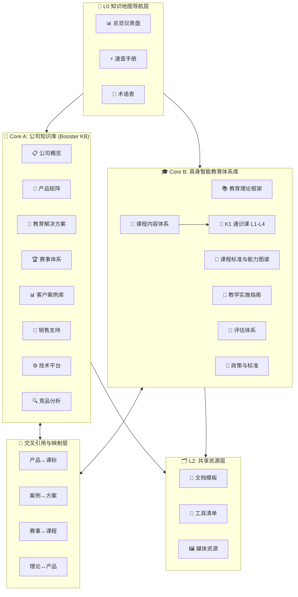
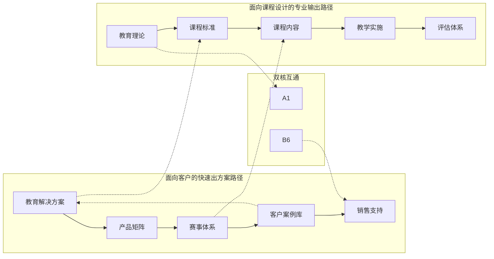

# 加速进化 K-12 课程设计师知识地图

## 一、全局架构图



## 二、模块关联关系图



## 三、角色导航路径

### 🎯 场景一：快速了解公司

```
入口: 00-navigation/dashboard.md
  → 01-booster-kb/01-company/profile.md        (公司基本信息)
  → 01-booster-kb/01-company/trust-assets.md   (信任状清单)
  → 01-booster-kb/02-products/_product-overview.md (产品全景)
```

### 🎯 场景二：为客户做教育方案

```
入口: 01-booster-kb/03-solutions/_solution-overview.md
  → 01-booster-kb/03-solutions/k12-{学段}.md   (按学段选方案模板)
  → 01-booster-kb/02-products/application-matrix.md (选产品)
  → 01-booster-kb/04-competitions/               (配赛事)
  → 01-booster-kb/05-cases/_cases-index.md      (找案例参考)
  → 01-booster-kb/02-products/pricing-guide.md   (报价)
  → 01-booster-kb/06-sales-support/elevator-pitch.md (话术)
```

### 🎯 场景三：设计具身智能课程

```
入口: 02-embodied-ai-edu/01-theory/what-is-embodied-ai-edu.md
  → 02-embodied-ai-edu/01-theory/competency-framework.md (确定素养框架)
  → 02-embodied-ai-edu/02-standards/k12-ability-map.md   (查阅能力图谱)
  → 02-embodied-ai-edu/03-curriculum/_curriculum-overview.md (选择课程线)
  → 02-embodied-ai-edu/04-implementation/teaching-guide.md   (设计实施方案)
  → 02-embodied-ai-edu/05-assessment/assessment-framework.md (设计评估)
```

### 🎯 场景四：回应客户质疑

```
入口: 01-booster-kb/06-sales-support/faq.md
  → 01-booster-kb/06-sales-support/objection-handling.md (异议处理)
  → 01-booster-kb/08-competitive-analysis/differentiation.md (差异化优势)
  → 01-booster-kb/01-company/trust-assets.md (信任状支撑)
```

### 🎯 场景五：教师培训准备

```
入口: 01-booster-kb/03-solutions/teacher-training.md
  → 02-embodied-ai-edu/04-implementation/teaching-guide.md
  → 01-booster-kb/07-tech-platform/dev-onboarding.md
```

### 🎯 场景六：政策研究与申报

```
入口: 02-embodied-ai-edu/06-policy/national-ai-policy.md
  → 02-embodied-ai-edu/02-standards/standard-alignment.md
  → 02-embodied-ai-edu/06-policy/
```

### 🎯 场景七：查阅 K1 课程库与备课

```
入口: 02-embodied-ai-edu/03-curriculum/k1-通识课/README.md
  → L1/L2/L3/L4 逐阶分析 (定位/课次表/关键技术点/课标映射)
  → 05-internal-materials/course-outlines/   (原始大纲+教案)
  → 03-cross-reference/theory-to-product.md  (课程→产品映射)
  → 03-cross-reference/competition-to-curriculum.md (L4 足球→RoboCup)
```

## 四、文档成熟度热力图

| 模块 | 完成度 | 状态 |
|------|--------|------|
| **Core A: 公司知识库** | | |
| A1 公司概览 | ██████████ 100% | ✅ 已完成 |
| A2 产品矩阵 | ██████████ 100% | ✅ 已完成 |
| A3 教育解决方案 | ██████████ 100% | ✅ 已完成 |
| A4 赛事体系 | ██████████ 100% | ✅ 已完成 |
| A5 客户案例库 | ████████░░ 80% | ✅ 框架完成，案例待积累 |
| A6 销售支持 | ██████████ 100% | ✅ 已完成 |
| A7 技术平台 | ██████████ 100% | ✅ 已完成 |
| A8 竞品分析 | ██████░░░░ 60% | 🔄 框架完成，竞品档案待填充 |
| **Core B: 教育体系库** | | |
| B1 教育理论框架 | ████████░░ 80% | 📝 框架完成 |
| B2 课程标准 | ████████░░ 80% | 📝 框架完成 |
| B3 课程内容体系 | ████████░░ 80% | ✅ K1 通识课 L1-L4 落地课纲已入库，课程线待细化 |
| 课程库（K1 通识课） | ████████░░ 80% | ✅ 54 份源文件归档 + 逐阶分析，4 份教案待补 |
| B4 教学实施 | ██████░░░░ 60% | 📝 框架完成 |
| B5 评估体系 | █████░░░░░ 50% | 📝 框架完成 |
| B6 政策标准 | ████████░░ 80% | 📝 框架完成 |
| **导航与共享层** | | |
| L0 导航层 | ██████████ 100% | ✅ 已完成 |
| L2 共享资源层 | ████████░░ 80% | ✅ 已完成 |
| 交叉引用层 | ██████████ 100% | ✅ 已完成 |
